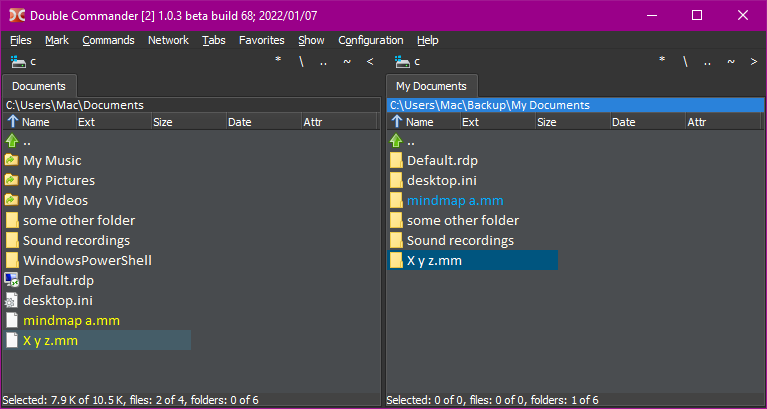
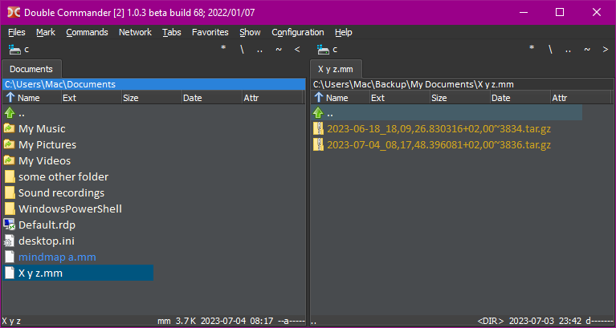

# Rumar

**A file-backup utility**

Creates a directory named as the original file, containing a **tar**red copy of the file, optionally compressed.

Files are added to the **tar** archive only if they were changed,\
_i.e. modification time is greater as compared to the last archive and size (or checksum) is different._

The directory containing **tar** files is placed in a mirrored directory tree.



\
Each backup is a separate **tar** file.



## How to use it

1. Install [Python](https://www.python.org/downloads/) (at least 3.9), if not yet installed
2. Download [rumar.py](https://raw.githubusercontent.com/macmarrum/rumar/main/src/rumar.py)
3. Download [rumar.toml](https://raw.githubusercontent.com/macmarrum/rumar/main/examples/rumar.toml) to the same directory as `rumar.py`
4. Edit `rumar.toml` and adapt it to your needs – see [settings details](#settings-details)
5. Open a console/terminal (e.g. PowerShell) and change to the directory containing `rumar.py`
6. If your installed Python version is below 3.11, run `python -m pip install tomli` to install the module [tomli](https://pypi.org/project/tomli/), if not yet done
7. Run `python rumar.py list-profiles` → you should see your profile name(s) printed in the console
8. Run `python rumar.py create --profile "My Documents"` to create a backup using the profile "My Documents"
9. Optionally, add this command to Task Scheduler or cron, to be run at an interval or each day/night

### How to sweep old backups

1. Run `python rumar.py sweep --profile "My Documents" --dry-run` and verify the files to be removed
2. Run `python rumar.py sweep --profile "My Documents"` to remove old backups
3. Optionally, add this command to Task Scheduler or cron, to be run at an interval or each day/night

Note: when `--dry-run` is used, **rumar.py** counts the backup files and selects those to be removed based on settings, but no files are actually deleted.

## Settings

Unless specified by `--toml path/to/your/settings.toml`,
settings are loaded from `rumar.toml` in the same directory as `rumar.py` or located in `rumar/rumar.toml` inside `$XDG_CONFIG_HOME` (`$HOME/.config` if not set) on POSIX,
or inside `%APPDATA%` on NT (Windows).

### Settings example

`rumar.toml`
<!-- rumar.toml example begin -->
```toml
# schema version
version = 2
# settings common for all profiles
backup_base_dir = 'C:\Users\Mac\Backup'

# setting for individual profiles - override any common ones

["My Documents"]
source_dir = 'C:\Users\Mac\Documents'
excluded_top_dirs = ['My Music', 'My Pictures', 'My Videos']
excluded_files_as_glob = ['desktop.ini', 'Thumbs.db']

[Desktop]
source_dir = 'C:\Users\Mac\Desktop'
excluded_files_as_glob = ['desktop.ini', '*.exe', '*.msi']

["# this profile's name starts with a hash, therefore it will be ignored"]
source_dir = "this setting won't be loaded"
```
#### For Python 3.13 or higher
```toml
# schema version
version = 3
# settings common for all profiles
backup_base_dir = 'C:\Users\Mac\Backup'

# setting for individual profiles - override any common ones

["My Documents"]
source_dir = 'C:\Users\Mac\Documents'
excluded_files = ['My Music\**', 'My Pictures\**', 'My Videos\**', '**\desktop.ini', '**\Thumbs.db']

[Desktop]
source_dir = 'C:\Users\Mac\Desktop'
excluded_files = ['**\desktop.ini', '**\*.exe', '**\*.msi']

["# this profile's name starts with a hash, therefore it will be ignored"]
source_dir = "this setting won't be loaded"
```
<!-- rumar.toml example end -->

### Settings details

Each profile whose name starts with a hash `#` is ignored when `rumar.toml` is loaded.\
**version** indicates schema version – currently `3`.

<!-- settings pydoc begin -->
* **backup_base_dir**: str &nbsp; &nbsp; _used by: create, sweep_\
  path to the base directory used for backup; usually set in the global space, common for all profiles\
  backup dir for each profile is constructed as _**backup_base_dir**_ + _**profile**_, unless _**backup_base_dir_for_profile**_ is set, which takes precedence
* **backup_base_dir_for_profile**: str &nbsp; &nbsp; _used by: create, extract, sweep_\
  path to the base dir used for the profile; usually left unset; see _**backup_base_dir**_
* **archive_format**: Literal['tar', 'tar.gz', 'tar.bz2', 'tar.xz', 'tar.zst'] = 'tar.gz' &nbsp; &nbsp; _used by: create, sweep_\
  format of archive files to be created
* **compression_level**: int = 3 &nbsp; &nbsp; _used by: create_\
  for the formats 'tar.gz', 'tar.bz2', 'tar.xz', 'tar.zst': compression level from 0 to 9
* **NO_COMPRESSION_SUFFIXES_DEFAULT**: str = '7z,zip,zipx,jar,rar,tgz,gz,tbz,bz2,xz,zst,zstd,xlsx,docx,pptx,ods,odt,odp,odg,odb,epub,mobi,cbz,png,jpg,gif,mp4,mov,avi,mp3,m4a,aac,ogg,ogv,kdbx' &nbsp; &nbsp; _used by: create_\
  comma-separated string of the default lower-case suffixes for which to use no compression
* **no_compression_suffixes**: str = '' &nbsp; &nbsp; _used by: create_\
  extra lower-case suffixes in addition to _**NO_COMPRESSION_SUFFIXES_DEFAULT**_
* **tar_format**: Literal[0, 1, 2] = 1 (tarfile.GNU_FORMAT) &nbsp; &nbsp; _used by: create_\
  see also https://docs.python.org/3/library/tarfile.html#supported-tar-formats and https://www.gnu.org/software/tar/manual/html_section/Formats.html
* **source_dir**: str &nbsp; &nbsp; _used by: create, extract_\
  path to the directory which is to be archived
* **included_files**: list[str] &nbsp; &nbsp; _used by: create, sweep_\
  ⚠️ caution: uses **PurePath.full_match(...)**, which is available on Python 3.13 or higher\
  a list of glob patterns, also known as shell-style wildcards, i.e. `** * ? [seq] [!seq]`; `**` means zero or more segments, `*` means a single segment or a part of a segment (as in `*.txt`)\
  if present, only the matching files will be considered, together with _**included_files_as_regex**_, _**included_files_as_glob**_, _**included_top_dirs**_, _**included_dirs_as_regex**_\
  the paths/globs can be absolute or relative to _**source_dir**_ (or _**backup_base_dir_for_profile**_ in case of _**sweep**_), e.g. `C:\My Documents\*.txt`, `my-file-in-source-dir.log`\
  absolute paths start with a root (`/` or `{drive}:\`)\
  on Windows, global-pattern matching is case-insensitive, and both `\` and `/` can be used\
  see also https://docs.python.org/3.13/library/pathlib.html#pathlib-pattern-language
* **excluded_files**: list[str] &nbsp; &nbsp; _used by: create, sweep_\
  ⚠️ caution: uses **PurePath.full_match(...)**, which is available on Python 3.13 or higher\
  the matching files will be ignored, together with _**excluded_files_as_regex**_, _**excluded_files_as_glob**_, _**excluded_top_dirs**_, _**excluded_dirs_as_regex**_\
  see also _**included_files**_
* **included_top_dirs**: list[str] &nbsp; &nbsp; _used by: create, sweep_\
  ❌ deprecated: use _**included_files**_ instead, if on Python 3.13 or higher, e.g. `['top dir 1/**',]`\
  a list of top-directory paths\
  if present, only the files from the directories and their descendant subdirs will be considered, together with _**included_dirs_as_regex**_, _**included_files**_, _**included_files_as_regex**_, _**included_files_as_glob**_,\
  the paths can be relative to _**source_dir**_ or absolute, but always under _**source_dir**_ (or _**backup_base_dir_for_profile**_ in case of _**sweep**_)\
  absolute paths start with a root (`/` or `{drive}:\`)
* **excluded_top_dirs**: list[str] &nbsp; &nbsp; _used by: create, sweep_\
  ❌ deprecated: use _**excluded_files**_ instead, if on Python 3.13 or higher, e.g. `['top dir 3/**',]`\
  the files from the directories and their subdirs will be ignored, together with _**excluded_dirs_as_regex**_, _**excluded_files**_, _**excluded_files_as_regex**_, _**excluded_files_as_glob**_\
  see also _**included_top_dirs**_
* **included_dirs_as_regex**: list[str] &nbsp; &nbsp; _used by: create, sweep_\
  a list of regex patterns (each to be passed to re.compile)\
  if present, only the file from the matching directories will be considered, together with _**included_top_dirs**_, _**included_files**_, _**included_files_as_regex**_, _**included_files_as_glob**_\
  `/` must be used as the path separator, also on Windows\
  the patterns are matched (using re.search) against a path relative to _**source_dir**_ (or _**backup_base_dir_for_profile**_ in case of _**sweep**_)\
  the first segment in the relative path to match against also starts with a slash\
  e.g. `['/B$',]` will match each directory named `B`, at any level; `['^/B$',]` will match only `{source_dir}/B` (or `{backup_base_dir_for_profile}/B` in case of _**sweep**_)\
  regex-pattern matching is case-sensitive – use `(?i)` at each pattern's beginning for case-insensitive matching, e.g. `['(?i)/b$',]`\
  see also https://docs.python.org/3/library/re.html
* **excluded_dirs_as_regex**: list[str] &nbsp; &nbsp; _used by: create, sweep_\
  the files from the matching directories will be ignored, together with _**excluded_top_dirs**_, _**excluded_files**_, _**excluded_files_as_regex**_, _**excluded_files_as_glob**_\
  see also _**included_dirs_as_regex**_
* **included_files_as_glob**: list[str] &nbsp; &nbsp; _used by: create, sweep_\
  ❌ deprecated: use _**included_files**_ instead, if on Python 3.13 or higher\
  a list of glob patterns, also known as shell-style wildcards, i.e. `* ? [seq] [!seq]`\
  if present, only the matching files will be considered, together with _**included_files**_, _**included_files_as_regex**_, _**included_top_dirs**_, _**included_dirs_as_regex**_\
  the paths/globs can be partial, relative to _**source_dir**_ or absolute, but always under _**source_dir**_ (or _**backup_base_dir_for_profile**_ in case of _**sweep**_)\
  unlike with glob patterns used in _**included_files**_, here matching is done from the right if the pattern is relative, e.g. `['B\b1.txt',]` will match `C:\A\B\b1.txt` and `C:\B\b1.txt`\
  ⚠️ caution: a leading path separator indicates an absolute path, but on Windows you also need a drive letter, e.g. `['\A\a1.txt']` will never match; use `['C:\A\a1.txt']` instead\
  on Windows, global-pattern matching is case-insensitive, and both `\` and `/` can be used\
  see also https://docs.python.org/3/library/fnmatch.html and https://en.wikipedia.org/wiki/Glob_(programming)
* **excluded_files_as_glob**: list[str] &nbsp; &nbsp; _used by: create, sweep_\
  ❌ deprecated: use _**excluded_files**_ instead, if on Python 3.13 or higher\
  the matching files will be ignored, together with _**excluded_files**_, _**excluded_files_as_regex**_, _**excluded_top_dirs**_, _**excluded_dirs_as_regex**_\
  see also _**included_files_as_glob**_
* **included_files_as_regex**: list[str] &nbsp; &nbsp; _used by: create, sweep_\
  if present, only the matching files will be considered, together with _**included_files**_, _**included_files_as_glob**_, _**included_top_dirs**_, _**included_dirs_as_regex**_\
  see also _**included_dirs_as_regex**_
* **excluded_files_as_regex**: list[str] &nbsp; &nbsp; _used by: create, sweep_\
  the matching files will be ignored, together with _**excluded_files**_, _**excluded_files_as_glob**_, _**excluded_top_dirs**_, _**excluded_dirs_as_regex**_\
  see also _**included_dirs_as_regex**_
* **checksum_comparison_if_same_size**: bool = False &nbsp; &nbsp; _used by: create_\
  when False, a file is considered changed if its mtime is later than the latest backup's mtime and its size changed\
  when True, BLAKE2b checksum is calculated to determine if the file changed despite having the same size\
  _mtime := last modification time_\
  see also https://en.wikipedia.org/wiki/File_verification
* **file_deduplication**: bool = False &nbsp; &nbsp; _used by: create_\
  when True, an attempt is made to find and skip duplicates\
  a duplicate file has the same suffix and size and part of its name, case-insensitive (suffix, name)
* **min_age_in_days_of_backups_to_sweep**: int = 2 &nbsp; &nbsp; _used by: sweep_\
  only the backups which are older than the specified number of days are considered for removal
* **number_of_backups_per_day_to_keep**: int = 2 &nbsp; &nbsp; _used by: sweep_\
  for each file, the specified number of backups per day is kept, if available\
  more backups per day might be kept to satisfy _**number_of_backups_per_week_to_keep**_ and/or _**number_of_backups_per_month_to_keep**_\
  oldest backups are removed first
* **number_of_backups_per_week_to_keep**: int = 14 &nbsp; &nbsp; _used by: sweep_\
  for each file, the specified number of backups per week is kept, if available\
  more backups per week might be kept to satisfy _**number_of_backups_per_day_to_keep**_ and/or _**number_of_backups_per_month_to_keep**_\
  oldest backups are removed first
* **number_of_backups_per_month_to_keep**: int = 60 &nbsp; &nbsp; _used by: sweep_\
  for each file, the specified number of backups per month is kept, if available\
  more backups per month might be kept to satisfy _**number_of_backups_per_day_to_keep**_ and/or _**number_of_backups_per_week_to_keep**_\
  oldest backups are removed first
* **commands_using_filters**: list[str] = ['create'] &nbsp; &nbsp; _used by: create, sweep_\
  determines which commands can use the filters specified in the included_* and excluded_* settings\
  by default, filters are used only by _**create**_, i.e. _**sweep**_ considers all created backups (no filter is applied)\
  a filter for _**sweep**_ could be used to e.g. never remove backups from the first day of a month:\
  `excluded_files = ['**/[0-9][0-9][0-9][0-9]-[0-9][0-9]-01_*.tar*']` or\
  `excluded_files_as_regex = ['/\d\d\d\d-\d\d-01_\d\d,\d\d,\d\d(\.\d{6})?[+-]\d\d,\d\d~\d+(~.+)?\.tar(\.(gz|bz2|xz))?$']`\
  it's best when the setting is part of a separate profile, i.e. a copy made for _**sweep**_,\
  otherwise _**create**_ will also seek such files to be excluded
* **db_path**: str = _**backup_base_dir**_/rumar.sqlite
<!-- settings pydoc end -->

### Settings schema version 3 vs 2

Version 3 has the additional settings _**included_files**_ and _**excluded_files**_.
They rely on `PurePath.full_match(...)`, which was added in Python 3.13.\
The new settings remove the need for the following ones:
* _**included_top_dirs**_
* _**excluded_top_dirs**_
* _**included_dirs_as_regex**_
* _**excluded_dirs_as_regex**_
* _**included_files_as_glob**_
* _**excluded_files_as_glob**_

### Settings schema version 2 vs 1

Version 1 contained _**sha256_comparison_if_same_size**_.\
In version 2 it's _**checksum_comparison_if_same_size**_.

## Logging settings

Logging is controlled by settings located in `rumar/rumar.logging.toml` inside `$XDG_CONFIG_HOME` (`$HOME/.config` if not set) on POSIX,
or inside `%APPDATA%` on NT (Windows).

By default, `rumar.log` is created in the current directory (where `rumar.py` is executed).\
To disable the creation of `rumar.log`,
copy the below to `rumar.logging.toml` in the appropriate location
and put a hash `#` in front of `"to_file",` in `[loggers.rumar]`.

<!-- logging settings begin -->
```toml
version = 1

[formatters.f1]
format = "{levelShort} {asctime}: {funcName:24} {msg}"
style = "{"
validate = true

[handlers.to_console]
class = "logging.StreamHandler"
formatter = "f1"
#level = "DEBUG_14"

[handlers.to_file]
class = "logging.FileHandler"
filename = "rumar.log"
encoding = "UTF-8"
formatter = "f1"
#level = "DEBUG_14"

[loggers.rumar]
handlers = [
    "to_console",
    "to_file",
]
level = "DEBUG_14"
```
<!-- logging settings end -->
More information: <https://docs.python.org/3/library/logging.config.html#logging-config-dictschema>

---
Copyright © 2023-2025 [macmarrum](https://github.com/macmarrum)\
SPDX-License-Identifier: [GPL-3.0-or-later](/LICENSE)
